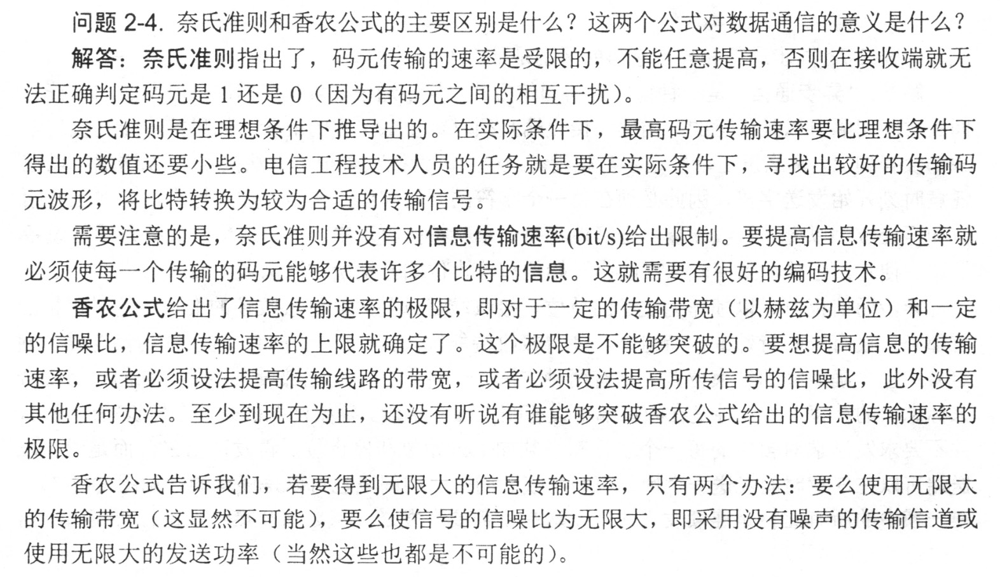

---
title: 信道的极限容量
---

从概念上讲, 限制码元在信道上的传输速率的因素有以下两个: 
- 信道能够通过的频率范围
- 信噪比

#### 奈氏准则

> 理想信道, 极限码元传输率 $2W$ 波特, 低信道下的极限数据传输率 `(b/s)` $=2W \log_2 V$. 
$W$ 是理想低通道的带宽, 单位为 `Hz`. $V$ 表示每个码元离散电平的数目. 

1. 码元传输的速率是有上限的, 超过次上限, 就会出现码间串扰问题, 使接收端不能完全正确识别码元.
1. 信道的频带越宽, 可更高的速率进行码元的有效传输.
1. 码元传输速率受奈氏准则制约, 要提高数据传输速率, 需要使每个码元携带更多比特的信息量, 需要采用多元制.

#### 香农定理

> 带宽受限且高斯白噪声干扰的信道的极限数据传输速率 $C = W \log_2(1+S/N)$. 
$S/N$ 为信噪比, 即信号平均功率与噪声平均功率之比, 位为分贝 `(dB)`. 信噪比 `(dB)` $= 10 \log_{10}(S/N)$. 

1. 信道的带宽或信道的信噪比越大, 信息的极限传输速率就越高.
1. 只要信息传输速率低于信道的极限信息传输速率, 就一定存在某种方法来实现无差别的传输.
1. 对一定的传输带宽和信噪比, 信息传输速率上限是一定的; 若信道带宽 $W$ 或信噪比 $S/N$ 没有上限, 则信道的极限信息传输速率 $C$ 也没有上限.
1. 码元传输的速率越高, 或信号传输的距离越远, 或噪声干扰越大, 或传输媒体质量越差, 在接收端的波形的失真就越严重.

#### 补充

