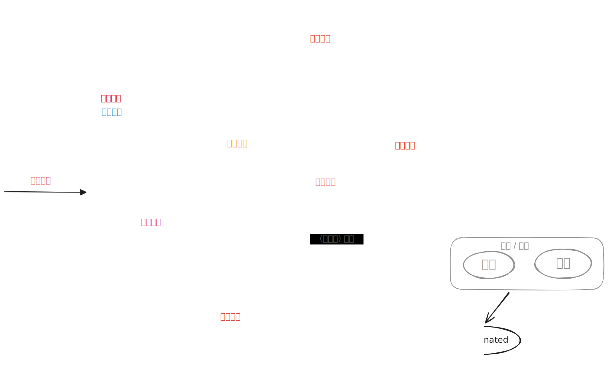

---
title: 七态模型及调度
---

由于多个进程在并发执⾏时共享系统资源, 致使它们在运⾏过程中呈现间断性的运⾏规律, 所以进程在其⽣命周期内可能具有多种状态.⼀般⽽⾔, 每⼀个进程⾄少应处于以下三种基本状态之⼀: 

- 就绪 [Ready] 状态. 这是指进程已处于准备好运⾏的状态, 即进程已分配到除 CPU以外的所有必要资源后, 只要再获得 CPU, 便可⽴即执⾏. 如果系统中有许多处于就绪状态的进程, 通常将它们按⼀定的策略 (如优先级策略) 排成⼀个队列, 称该队列为就绪队列.

- 执⾏ [Running] 状态. 这是指进程已获得 CPU, 其程序正在执⾏的状态. 对任何⼀个时刻⽽⾔, 在单处理机系统中, 只有⼀个进程处于执⾏状态,⽽在多处理机系统中, 则有多个进程处于执⾏状态.

- 阻塞 [Block] 状态. 这是指正在执⾏的进程由于发⽣某事件 (如 `I/O` 请求、 申请缓冲区失败等) 暂时⽆法继续执⾏时的状态, 亦即进程的执⾏受到阻塞. 此时引起进程调度, OS 把处理机分配给另⼀个就绪进程,⽽让受阻进程处于暂停状态,⼀般将这种暂停状态称为阻塞状态, 有时也称为等待状态或封锁状态. 通常系统将处于阻塞状态的进程也排成⼀队列, 称该队列为阻塞队列. 实际上, 在较⼤的系统中, 为了减少队列操作的开销, 提⾼系统效率, 根据阻塞原因的不同, 会设置多个阻塞队列. 

#### 挂起原因

1. 终端用户的需要. 自己程序运行期间发现可疑问题.
1. 父进程请求. 父进程希望挂起自己子进程.
1. 负荷调节的需要. 实时系统工作负荷较重, 影响对实时任务的控制.
1. 操作系统的需要. 检查运行中的资源使用情况或进行记账

