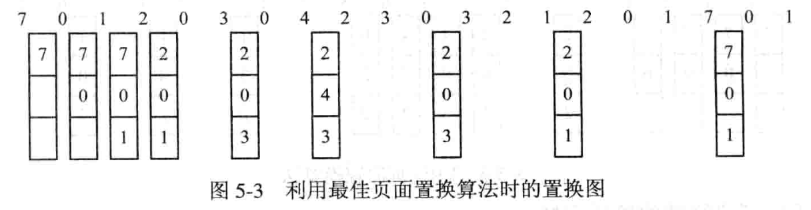

---
title: 最佳置换算法 OPT
---

最佳置换算法是由 Belady 于 1966 年提出的⼀种理论上的算法. 其所选择的被淘汰页⾯将是以后永不使⽤的, 或许是在最长 (未来) 时间内不再被访问的页⾯. 采⽤最佳置换算法通常可保证获得最低的缺页率. 但由于⼈们⽬前还⽆法预知,⼀个进程在内存的若⼲个页⾯中, 哪⼀个页⾯是未来最长时间内不再被访问的, 因⽽该算法是⽆法实现的, 但可以利⽤该算法去评价其它算法. 

