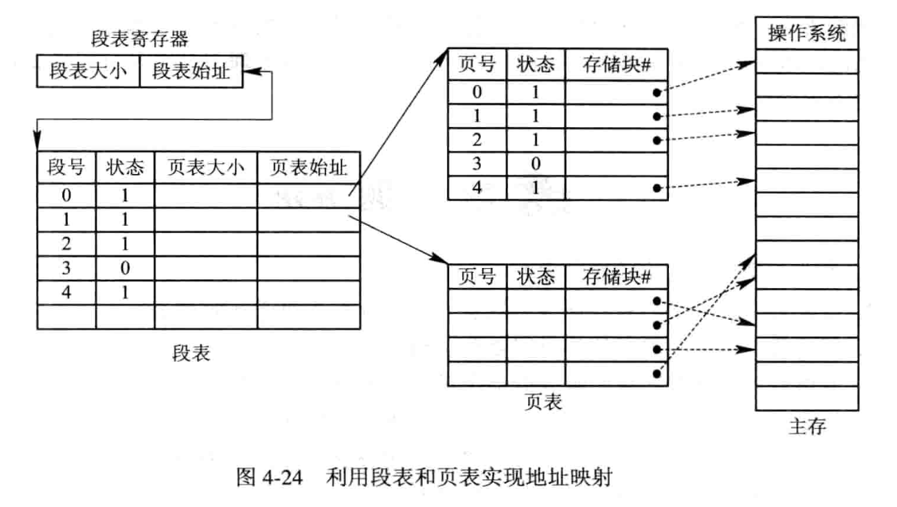
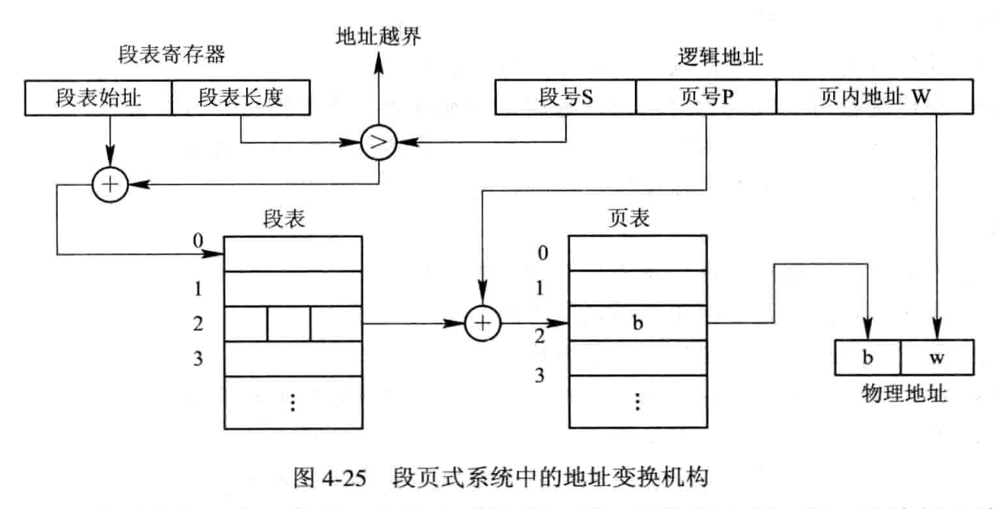

---
title: 段页式存储管理⽅式
---

这是分页和分段两种存储管理⽅式相结合的产物. 它同时具有两者的优点, 是⽬前应⽤较⼴泛的⼀种存储管理⽅式.

分页系统以页⾯作为内存分配的基本单位, 能有效地提⾼内存利⽤率,⽽分段系统以段作为内存分配的基本单位, 它能够更好地满⾜⽤户多⽅⾯的需要. 如果能对两种存储管理⽅式 “各取所长”, 则可形成⼀种新的存储器管理⽅式—段页式存储管理⽅式. 这种新的系统既具有分段系统的便于实现、 分段可共享、 易于保护、 可动态链接等⼀系列优点,又能像分页系统那样, 很好地解决内存的外部碎⽚问题. 

段页式系统的基本原理是分段和分页原理的结合, 即 *先将⽤户程序分成若⼲个段, 再把每个段分成若⼲个页, 并为每⼀个段赋予⼀个段名.* 

*在段页式系统中, 为了实现从逻辑地址到物理地址的变换, 系统中需要同时配置段表和页表.* 段表的内容与分段系统略有不同, 它不再是内存始址和段长, 而是页表始址和页表长度. 上图示出了利用段表和页表进行从用户地址空间到物理 (内存) 空间的映射. 

