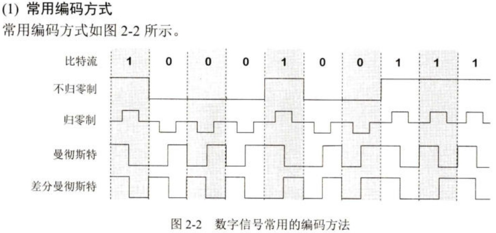

---
title: 计算机网络 Lesson 2
tag: 
---

$\gdef\spaces#1{~ #1 ~}$
$\gdef\str#1{\footnotesize{#1}}$
$\gdef\hint#1{{\color{gray}{\str{#1}}}}$
$\gdef\type#1{~:~\texttt{#1}}$

电路交换的三个阶段: 建立连接, 通信, 释放连接. 

计算机网络的性能指标主要包括: 
- 速率
- 带宽
- 吞吐率
- 时延
- 时延带宽积
- 往返时间 RTT
- 利用率

区分 `MiB → GiB (/1000)` 和 `MB → GB (/1024)` 换算的区别. `1kb/s = 10³b/s`. 

吞吐量 [throughput] 表示在单位时间内通过某个网络(或信道、接口) 的数据量. 吞吐量更经常地用于对现实世界中的网络的一种测量, 以便知道实际上到底有多少数据量能够通过网络. 吞吐量受网络的带宽或网络的额定速率的限制. 

时延 [delay / latency] 是指数据 (一个报文或分组, 甚至比特) 从网络 (或链路) 的一端传送到另一端所需的时间. 有时也称为延迟或迟延. 网络中的时延由以下几个不同的部分组成: 

1. 发送时延 $~ = ~ \dfrac{\str{数据帧长度; 数据块长度} ~ l \type{bit}}{\str{发送速率; 信道带宽} ~ v \type{bit/s}}$

1. 传播时延 $~ = ~ \dfrac{\str{信道长度} ~ l \type{m}}{\str{信号在信道上的传播速率} ~ v \type{m/s}}$

1. 处理时延 

1. 排队时延

### 利用率分为信道利用率和网络利用率

信道利用率指出某信道有百分之几的时间是被利用的 (有数据通过). 

- 完全空闲的信道的利用率是零. 
- 网络利用率则是全网络的信道利用率的加权平均值.
- 信道利用率并非越高越好. 当某信道的利用率增大时, 该信道引起的时延也就迅速增加.

$$
D ~ \hint{当前时延} \spaces= \frac{D_0 ~ \hint{空闲时延}}{1-U ~ \hint{网络利用率}}
$$

这里网络利用率 $U \in [0, 1]$.

### 协议与划分层次

计算机网络中的数据交换必须遵守事先约定好的规则.
这些规则明确规定了所交换的数据的格式以及有关的同步问题 (同步含有时序的意思). 网络协议 (Network Protocol), 简称为协议, 是为进行网络中的数据交换而建立的规则、标准或约定. 

> 协议是水平的, 服务是垂直的. 

### 具有五层协议的体系结构

| OSI 的体系结构 | (四层) TCP/IP 的体系结构 | 五层协议的体系结构 |
| - | - | - |
| 7	应用层 | 应用层 (应用层协议如	DNS, HTTP, SMTP, RTP 等) | 5 应用层 |
| 6 表示层 |  
| 5 会话层 |
| 4 运输层 | 运输层 (TCP 或UDP) | 4 运输层 |
| 3 网络层 | 网际层 IP | 3 网络层 |
| 2 数据链路层 | 网络接口层 (这一层并没有具体内容) | 2 数据链路层
| 1 物理层 | $\hint{网络接口层}$ | 1 物理层 |

### 物理层

常用术语

- 数据 [data] --- 运送消息的实体.
- 信号 [signal] --- 数据的电气的或电磁的表现.
- 模拟信号 [analogous signal] --- 代表消息的参数的取值是连续的.
- 数字信号 [digital signal] --- 代表消息的参数的取值是离散的.
- 码元 [code] --- 在使用时间域 (或简称为时域) 的波形表示数字信号时, 代表不同离散数值的基本波形.

有关信道的几个基本概念

- 信道 --- 一般用来表示向某一个方向传送信息的媒体.
- 单向通信 (单工通信) --- 只能有一个方向的通信而没有反方向的交互.
- 双向交替通信 (半双工通信) --- 通信的双方都可以发送信息, 但不能双方同时发送 (当然也就不能同时接收).
- 双向同时通信 (全双工通信) --- 通信的双方可以同时发送和接收信息.

调制分为两大类:

- 基带调制: 仅对基带信号的波形进行变换, 使它能够与信道特性相适应. 变换后的信号仍然是基带信号. 把这种过程称为编码 (coding).
- 带通调制: 使用载波 (carrier) 进行调制, 把基带信号的频率范围搬移到较高的频段, 并转换为模拟信号, 这样就能够更好地在模拟信道中传输 (即仅在一段频率范围内能够通过信道). 
  - 带通信号: 经过载波调制后的信号.

- 不归零制: 正电平代表 1, 负电平代表 0. 
- 归零制: 正脉冲代表 1, 负脉冲代表 0. 
- 曼彻斯特编码: 位周期中心的向上跳变代表 0, 位周期中心的向下跳变代表 1. *但也可反过来定义*. 
- 差分曼彻斯特编码: 在每一位的中心处始终都有跳变, 位开始边界有跳变代表 0, 而位开始边界没有跳变代表 1. 

从信号波形中可以看出, 曼彻斯特 [Manchester] 编码产生的信号频率比不归堆制高. 从自同步能力来看, 不归零制不能从信号波形本身中提取信号时钟频率, 这叫作没有自同步能
力, 而曼彻斯特编码具有自同步能力. 
