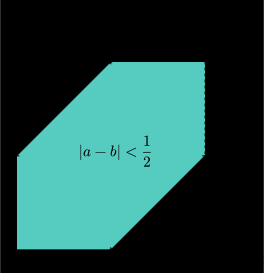

---
title: 概率论 Lesson 2
tag: 
---

$\gdef\str#1{\footnotesize{#1}}$

$\textbf{Example (\str{几何概型}).}$ 任取两个数 $a,b \in [0, 1]$, 求 $|a-b|<\frac12$ 的概率. 

如图, 我们只须计算平面上 $|a-b|<\frac12$ 区域的面积 $S$, 所求概率 $P = \frac{\mu(S)}{\mu(\Omega)}$, 即 $1-2 \cdot (\frac12)^3 = \frac34$. 
