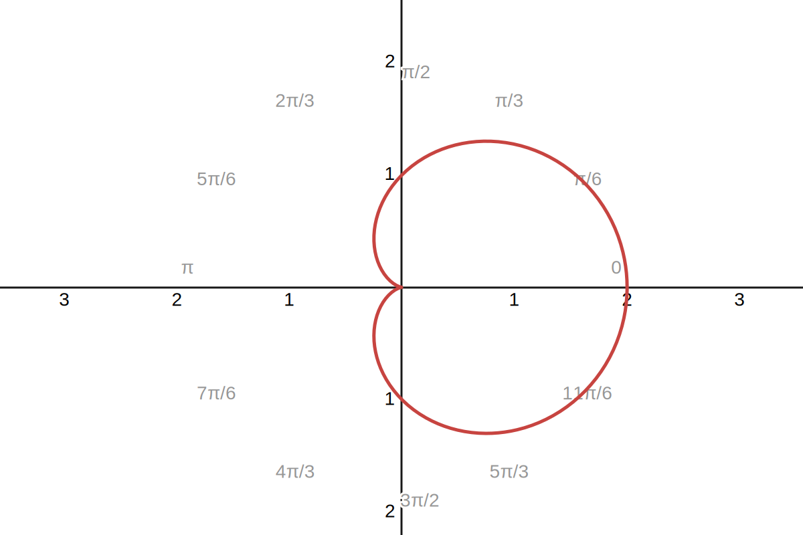

---
title: 心形线面积
taxon: problem
tag: 
---

$\gdef\spaces#1{~ #1 ~}$
$\gdef\d{\operatorname{d}}$

求由心形线 $r = a(1+\cos \theta)$, $a>0$ 所围区域的面积

如图, 我们先计算 $y>0$ 的部分, 由  可知其面积 $S$ 为  

$$
\begin{aligned}
S 
&\spaces= \int_0^\pi a^2(1+\cos\theta)^2 \d \theta \\
&\spaces= a^2 \int_0^\pi \Big(2\cos^2\frac{\theta}2\Big)^2 \d \theta \\
&\spaces= 4a^2 \int_0^\pi \cos^4\frac{\theta}2 \d \theta \\
&\spaces= 8a^2 \int_0^{\frac\pi2} \cos^4 t \d t \\
&\spaces= \frac{3\pi a^2}{2}
\end{aligned}
$$

最后使用了 , $W_4 = \frac{3!!}{4!!} \cdot \frac\pi2 = \frac{3\pi}{16}$. 故区域面积为 $3\pi a^2$. 

